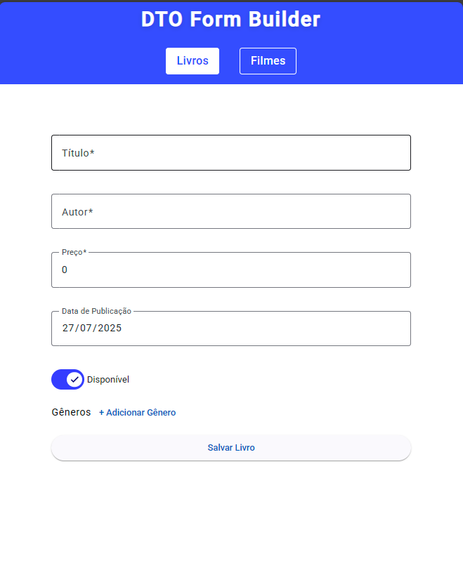
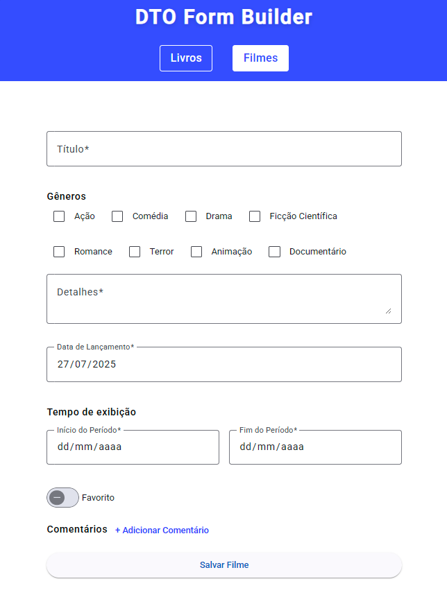

# DTO Form Builder

Projeto Angular que demonstra a construção de formulários reativos baseados em DTOs, com foco em organização, reutilização e padronização de código.

## Padrões Utilizados

- **DTO (Data Transfer Object):** Cada entidade possui uma interface DTO e uma classe de formulário correspondente, centralizando regras de validação e transformação.
- **Reactive Forms:** Utilização do Angular Reactive Forms para maior controle e flexibilidade.
- **Material Design:** Interface moderna e responsiva com Angular Material.
- **ESLint:** Configuração robusta na raiz do projeto para garantir código limpo e padronizado, integrando Standard, Prettier e TypeScript.

## O que foi implementado

- **BookForm:** Formulário de livros com campos dinâmicos de gêneros (texto livre), validações de campos obrigatórios e valores mínimos.
- **MovieForm:** Formulário de filmes com seleção de gêneros via checkboxes (lista fixa), validação customizada para garantir ao menos um gênero selecionado, além de validação de intervalo de datas.
- **Componentização:** Cada formulário encapsulado em seu próprio componente standalone.
- **Validações customizadas:** Exemplo de validação de array (gêneros) e de intervalo de datas.
- **Organização:** Estrutura de pastas separando domínio, utilitários e views.
- **Testes unitários:** Estrutura pronta para testes de componentes e formulários.

## Diferença entre as implementações de formulário

- **BookForm:**  
  - Os gêneros são campos de texto adicionados dinamicamente pelo usuário.
  - Utiliza um `FormArray` de `FormControl` para cada gênero.
  - Permite gêneros livres, sem limitação de valores.

- **MovieForm:**  
  - Os gêneros são checkboxes baseados em uma lista fixa (`GENRES`).
  - Utiliza um `FormArray` de booleanos, um para cada gênero disponível.
  - Validação customizada garante que pelo menos um gênero seja selecionado.
  - Inclui validação de datas (início/fim do período de exibição).

## ESLint e Prettier

O projeto possui um arquivo [.eslintrc.json](.eslintrc.json) na raiz, configurado para:

- Padronizar o código com Standard, Prettier e TypeScript.
- Forçar boas práticas e evitar erros comuns.
- Organizar imports automaticamente.
- Regras específicas para ignorar variáveis não usadas iniciadas por `_`, limitar tamanho de linha, uso de ponto e vírgula, entre outras.

## Organização das pastas

```plaintext
src/app/
  core/utils/generators/   # Funções utilitárias e geradores de formulários
  domain/                  # Lógica de domínio (DTOs e Forms)
    book/
      dto/
      form/
    movie/
      dto/
      form/
  views/                   # Componentes de interface (standalone)
    book/
    movie/
  app.config.ts            # Configuração global
  app.routes.ts            # Rotas centralizadas
```

## Scripts

- `npm start` — Inicia o servidor de desenvolvimento.
- `npm run build` — Compila o projeto.
- `npm test` — Executa os testes unitários.
- `npm run lint` — (Se configurado) Executa o ESLint.

## Como rodar

```sh
npm install
npm start
```

- Acesse http://localhost:4200.

## Como expandir
- Para adicionar uma nova entidade, crie um novo diretório em domain/{entidade} com os arquivos DTO e Form.
- Use o gerador de formulários para evitar repetição de código.
- Utilize ESLint ``npm run lint`` para manter o padrão do projeto.

## Testes
- Testes unitários para componentes e formulários já configurados.
- Use ``npm test`` para rodar os testes.

## Dicas
- Sempre utilize o gerador de formulários para evitar repetição de código.
- Mantenha as validações centralizadas nas classes de formulário.
- Use ESLint e Prettier para garantir a qualidade do código.
- Escreva testes unitários para cada novo formulário ou componente.
- Para mais detalhes, veja os arquivos de implementação dos formulários:
  - **BookForm**
  - **MovieForm**

## Exemplos Visuais

<div align="center">
  
  
</div>
